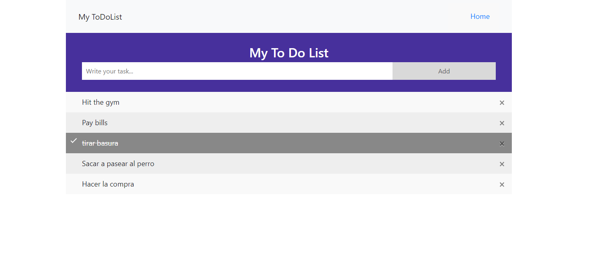

# todolist
***
This code repo contains the code developed for a Go rest API consisting of a simple ToDoList service.


## Table of Contents
1. [General Info](#general-info)
2. [Technologies](#technologies)
3. [Requirements](#requirements)
4. [Installation](#installation)
5. [Authentication](#authentication)
5. [Testing](#testing)
6. [API docs](#api-docs)
### General Info
***
At this time, you have a RESTful API server running at `http://127.0.0.1:8000`. It provides the following endpoints:

* `GET /tasks`: get the list of all tasks
* `POST /tasks`: add a new task
* `PUT /tasks/:id`: mark a task as completed
* `DELETE /tasks/:id`: deletes a task

The API achieves data persistence using a PostgreSQL implemented database with the SQL-boiler ORM. This database is initialized with a single "tasks" table. This table contains the columns of 'id', 'name' and 'check_valid'.
### Technologies
***
A list of technologies used within the project:
* [Go](https://go.dev): Version 1.18.3
* [Docker](https://www.docker.com)
* [rs/cors](https://github.com/rs/cors)
* [gorilla/mux](https://"github.com/gorilla/mux)
* [stretchr/testify](https://github.com/stretchr/testify)
* [volatiletech/sqlboiler](https://github.com/volatiletech/sqlboiler)
* [PostgreSQL](https://www.postgresql.org)
* [Swagger](https://swagger.io)
* [go-openapi/runtime](https://github.com/go-openapi/runtime)
### Requirements
***
For the project to launch, you will need Docker installed, and preferably the Make tool too.
### Installation
***
To install this project you need to clone or download it. 
```
$ git clone https://github.com/jorgefg4/todolist.git

```
Then you have two options.
- Not having Make:

    Enter the root folder and then execute:
    ```
    $ docker-compose build
    $ docker-compose up
    ```
    To stop the app, execute `docker-compose down`.

- Having Make:

    Enter the root folder, then execute - `make`. To stop the app, execute - `make stop`.
### Authentication
***
 There are no authentication implemented yet. So, all the end-points are open.
### Core Resources
***
`Task` object represents snapshot of a specific task with a unique Id.
### API docs
***
This specification follows the Swagger specification. It is written in YAML and deployed automatically using ReDoc.
You can access the API documentation in the path `localhost:8000/api-doc`
### Testing
***
For the execution of the API tests, it will be possible to execute `make test` to execute all the tests.


 
